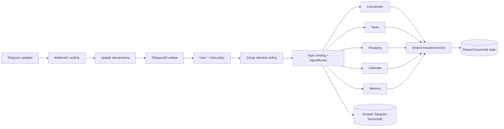

# Telegram Platform v3

## Goal

Turn Telegram from a single private-chat transport into a first-class household runtime with:

- private chats, groups, supergroups and forum topics;
- isolated conversation context per `chat_id + message_thread_id`;
- topic-to-agent bindings and automatic specialist routing;
- topic lifecycle management;
- explicit chat and user authorization;
- webhook idempotency;
- feature-gated access to Bot API capabilities newer than the installed Python library.

## Architecture



The important boundary is deliberate: household state is shared, but conversational history is not. A calendar discussion in one topic does not leak into a shopping topic or an unrelated group.

## Implemented capabilities

| Area | Support |
|---|---|
| Private chat | Full natural-language and command flow |
| Groups / supergroups | Allow-list plus configurable attention policy |
| Forum topics | Create, list, rename, close, reopen and delete |
| Private-chat topics | Supported when enabled in BotFather and configuration |
| Sub-agents | Coordinator, tasks, shopping, calendar and memory |
| Topic bindings | `/agent <id>` or automatic routing |
| Topic lifecycle sync | Service-message tracking in SQLite |
| Scoped memory | Transcript and rolling summary per topic/agent |
| Chat membership | Bot and member state tracking |
| Webhook retries | Processing/done/failed update ledger |
| Advanced Bot API | Raw, opt-in capability adapter with safe fallback |

## Group behavior

`TELEGRAM_GROUP_RESPONSE_MODE`:

- `all`: respond to every eligible message;
- `mentions`: respond only to mentions and replies to the bot;
- `topics`: respond only in topics bound to an agent;
- `mention_or_topic`: recommended default.

Groups are fail-closed by default. Add their IDs to `ALLOWED_CHAT_IDS`, or intentionally set `TELEGRAM_ALLOW_UNLISTED_GROUPS=true`.

Telegram Privacy Mode still matters. For ambient group operation, disable Privacy Mode in BotFather or make the bot an administrator. For mention/reply-only operation, Privacy Mode can remain enabled.

## Topic commands

- `/topic Name | calendar`
- `/topics`
- `/agent tasks`
- `/agent auto`
- `/topic_rename New name`
- `/topic_close`
- `/topic_open`
- `/topic_delete`
- `/chatid`

The bot needs **Manage Topics** permission in forum supergroups.

## Bot API compatibility

As of July 2026, Telegram Bot API 10.2 includes Rich Messages, Ephemeral Messages and Communities. `python-telegram-bot` 22.8 natively supports Bot API 10.0. The project therefore uses two paths:

1. PTB for all stable 10.0-and-earlier capabilities.
2. `TelegramRawApi` for explicitly enabled 10.1/10.2 methods.

Raw features default to off. Enable only after testing with the target Telegram clients:

```env
TELEGRAM_RAW_API_ENABLED=true
TELEGRAM_ENABLE_EPHEMERAL_MESSAGES=true
TELEGRAM_ENABLE_RICH_MESSAGES=false
```

Ephemeral group acknowledgements are already wired as a best-effort enhancement. Rich-message payload generation and Communities orchestration should be added behind the same adapter, not directly inside handlers.

## BotFather checklist

1. Enable groups.
2. Decide whether Privacy Mode stays enabled.
3. Enable topic mode for the bot's private chat when private topics are desired.
4. In group forums, promote the bot with Manage Topics.
5. Configure the Main Mini App URL.
6. Re-add the bot after changing Privacy Mode.

## Next implementation slices

1. Stream model output through `sendMessageDraft` and `sendRichMessageDraft`.
2. Add rich structured renderers for task lists, tables and calendar cards.
3. Add Telegram-native inline queries for quick household lookup.
4. Add media ingestion: voice transcription, photos, documents and location.
5. Add optional managed child bots only where separate Telegram identities provide real value; internal sub-agents should remain the default.
6. Add Communities event ingestion once PTB exposes Bot API 10.2 objects natively.
