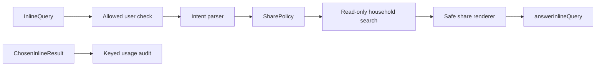

# Telegram Share Anywhere

## Goal

Allow an approved household member to retrieve and deliberately share a small,
safe operational summary from any Telegram chat by typing the bot username.

Examples:

```text
@SharedHomeBot קניות חלב
@SharedHomeBot משימות אינסטלטור
@SharedHomeBot אירועים שישי
```

The feature is read-only. Choosing a result posts the rendered card into the
current chat; it does not mutate household state.

## Architecture



`SharePolicy` and the renderers are surface-independent. Guest Mode and future
Mini App share flows should reuse them instead of creating separate allowlists.

## Shareable data

| Kind | Included | Deliberately excluded |
|---|---|---|
| Task | Title, due time, coarse priority | Description, assignee details, private context |
| Shopping | Item, quantity, category | Household memory and purchase history |
| Event | Title and start time | Location, description, attendees, organizer, meeting secrets |
| Help | Usage examples | Household state |

The following entity classes are blocked for external surfaces: memory, core
memory, notes, people, settings, files, Google Docs, Google Sheets and
credentials.

## Authorization and telemetry

- The querying Telegram user must be present in `ALLOWED_USER_IDS`.
- Results are returned with `is_personal=true` and a short cache lifetime.
- Unknown users receive an empty result set.
- The service enforces authorization internally as well as in the handler.
- Search text is not stored. Optional chosen-result telemetry stores an opaque
  result identifier and a keyed HMAC of the query using the application secret.
  This prevents offline dictionary matching without access to that secret.
- Usage rows older than the configured retention window are deleted when the
  inline usage store is initialized.
- Telemetry is best-effort and can never fail Telegram update processing.

## Configuration

```env
TELEGRAM_INLINE_ENABLED=true
TELEGRAM_INLINE_MAX_RESULTS=20
TELEGRAM_INLINE_CACHE_SECONDS=3
TELEGRAM_INLINE_USAGE_RETENTION_DAYS=30
```

`TELEGRAM_INLINE_MAX_RESULTS` is clamped to Telegram's limit of 50. Cache time is
clamped to 0–300 seconds. Usage retention is clamped to 1–365 days.

## BotFather rollout

1. Open BotFather and run `/setinline` for the bot.
2. Use a placeholder such as `חיפוש קניות, משימות ואירועים`.
3. Optionally run `/setinlinefeedback` to receive `ChosenInlineResult` updates.
   Start with a sampled feedback rate if usage becomes high.
4. Deploy with `TELEGRAM_INLINE_ENABLED=true`.
5. Test from an allow-listed user in a private chat, a group and a channel draft.
6. Confirm that an unknown Telegram account receives no results.

## Query behavior

Recognized prefixes:

- `קניות`, `shop`, `shopping`
- `משימות`, `task`, `todo`
- `אירועים`, `event`, `calendar`, `יומן`
- `עזרה`, `help`

Without a prefix, the service searches all safe operational categories. An empty
query returns a compact dashboard of the first open items plus a help result.
Results use offset pagination and never invoke an LLM, keeping response latency
and cost predictable.

## Future extensions

1. Reuse `SharePolicy` and renderers for Guest Mode.
2. Add explicit per-entity `share_classification` when projects/tasks gain richer
   privacy requirements.
3. Add Mini App `switchInlineQuery` actions to select a destination chat.
4. Add structured rich-message renderers behind the existing Telegram raw API
   feature gate.
5. Add aggregate usage views without storing query content.
